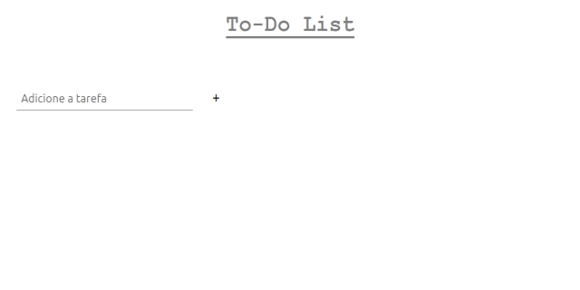
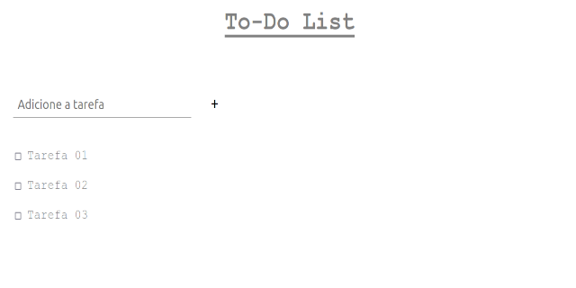
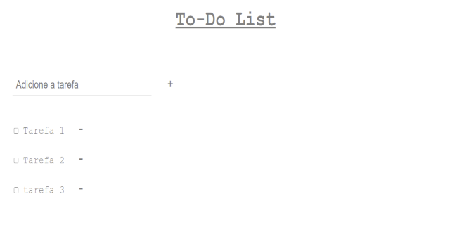
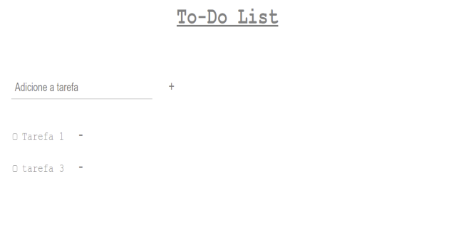

# To-Do-List
Projeto simples para aprendizado de JavaScript puro.

- Consiste em uma Lista de Tarefas Simples (To-Do List) onde uma o texto que representa a tarefa é adicionado em um input e a tarefa é adicionada a uma lista após o clique no botão "+".

- Quando a tarefa é concluída, pode-se clicar no checkbox e a tarefa fica riscada. Marcando-a como executada.

- Se quiser apagar a tarefa, bastar clicar no sinal ' - ' ao lado direito da tarefa que ela será apagada.

PRÓXIMAS FEATURES:

- implementar uma validação para que não seja permitida a inserção de uma tarefa repetida
