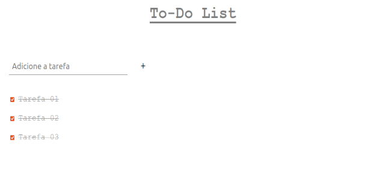

# To-Do-List
Projeto simples para aprendizado de JavaScript puro.

- Consiste em uma Lista de Tarefas Simples (To-Do List) onde uma o texto que representa a tarefa é adicionado em um input e a tarefa é adicionada a uma lista após clicar em "Enter" ou no botão "+", na tela.

Se a tarefa a ser inserida já existir na lista de tarefas, não será possível seguir com a inclusão e aparecerá um alerta na tela informando que a tarefa já existe.

- em caso de tarefa nova

- em caso de tarefa na lista

- Quando a tarefa é concluída, pode-se clicar no checkbox e a tarefa fica riscada. Marcando-a como executada.

- Se quiser apagar a tarefa, bastar clicar no sinal ' - ' ao lado direito da tarefa que ela será apagada.

- Se quiser editar a tarefa, basta clicar sobre o texto da tarefa que uma caixa de texto aparecerá

... depois é só inserir ou corrigir o texto da tarefa

... e teclar que sua tarefa estará editada.

PRÓXIMAS FEATURES:

- correção do bug da "tarefa fantasma". O bug ocorre quando apagamos todo o texto da tarefa existente e clicamos "enter". Fica somente o checkbox e o botão de excluir a tarefa, sem texto.
